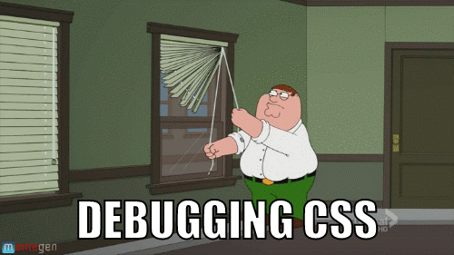

# 1.2.2 - CSS Properties

---

CSS Properties are used to indicate which styles to apply.

```css
.mybox {
    color: #000;
    border: 1px solid red;
    background-color: red;
}
```

---

- There are many CSS properties.
- You can use this [reference](https://developer.mozilla.org/en-US/docs/Web/CSS/Reference#Keyword_index) to see which properties are available.
- The inspector can also autocomplete the various properties and their respective values.

---

### Exercise 1 [🐇](https://codepen.io)

Write the CSS to make the cat text blue.

```html
<p class='canine'>Husky</p>
<p class='feline'>Felix the Cat</p>
<p class='canine'>Labrador</p>
```

```css
/* css here */

```

---

### Exercise 2 [🐇](https://codepen.io)

Write the CSS to make the cat text blue.

```html
<h1 class="animal">Husky</h1>
<h2 class="animal">Felix the cat</h2>
<h1 class="animal">Labrador</h1>
```

```css
/* css here */

```

---

### Exercise 3 [🐇](https://codepen.io)

Write the CSS to make the cat text blue.

```html
<p id="royalcat" class="good-boy">Husky</p>
<p class="royalcat">Felix the cat</p>
```

```css
/* css here */

```

---

### Exercise 4 [🐇](https://codepen.io)

Write the CSS to make the dogs text red.

```html
<p class="canine">Husky</p>
<p class="feline">Felix the cat</p>
<p class="canine">labrador</p>
```

```css
/* css here */

```

---

### Exercise 5 [🐇](https://codepen.io)

Write the CSS to make the dogs text red.

```html
<h1 class="animal">Husky</h1>
<h2 class="animal">Felix the cat</h2>
<h1 class="animal">Labrador</h1>
```

```css
/* css here */

```

---

### Exercise 6 [🐇](https://codepen.io)

What color is the `p` element?

`<p class="blue"> hello </p>`

```css
.blue {
    color: blue
}
p {
    color: red
}

```

---

## The Box Model

---

Every HTML element is a box that has 4 properties.

| property  | notes |
| --------- | ----- |
| content   | the content 
| `padding` | space around content
| `border`  | border around padding
| `margin`  | space outside of border

---


- Each side can be set independently

|                 |
| --------------- |
| `margin-left`   |
| `margin-right`  |
| `margin-bottom` |

--- 

- Shorthand is best
    - `margin: top | right | bottom | left`
    - `margin: 20px 10px 5px 0`
    - `margin: 20px 10px`
    - `margin: 20px`

---

### Example

What is the width and height of this box?

`<p class='greeting'>Hello</p>`

```css
.greeting {
    border-width: 10px;
    height: 100px;
    margin: 50px;
    padding: 25px;
    width: 100px;
}
```

---

We can fix this with the `box-sizing` CSS property.

```css
* {
    box-sizing: border-box;
}
```

_What is the meaning of `*`?_

---


---

## The [Display](https://www.w3schools.com/cssref/pr_class_display.asp) property

- block
- inline-block
- inline
- none
- _there are many more_

---

### `display: block`

- It starts on a new line, and takes up the whole width.

---

### `display: inline`

- Displays an element as an inline element.
- Any height and width properties will have no effect.

---

### `display: inline-block`

- The element itself is formatted as an inline element, but you can apply height and width values.

---

### `display: none`

- The element is completely removed! 

---

### Elements already have their own display behavior

- Block-level elements
    - `<h1>`, `<h2>`, `<h3>`, `<h4>`, `<h5>`, `<h6>`, `<p>`
    - `<ul>`, `<ol>`, `<li>`, `<blockquote>`, `<table>`,
    - `<form>`
    - `<div>`

--- 

- Inline elements
    - ``, `<a>`, `<span>`, `<button>`
    - `<input>`, `<label>`, `<select>`, `<textarea>`
    - `<abbr>` 

[Source](https://www.w3resource.com/html/HTML-block-level-and-inline-elements.php)

---

### Investigate later

[Display property playground](https://www.w3schools.com/csSref/playit.asp?filename=playcss_display&preval=inline)

---

### [`display: none`](https://www.w3schools.com/css/tryit.asp?filename=trycss_display_none)
### vs. 
### [`visibility: hidden`](https://www.w3schools.com/css/tryit.asp?filename=trycss_visibility_hidden)

---

## The [Position](https://www.w3schools.com/css/css_positioning.asp) property

- static (_default_)
- relative
- fixed
- absolute

---

### `position: static`

- It is not positioned in any special way; it is always positioned according to the normal flow of the page.

---

### `position: relative`

- It is positioned relative to its normal position.
- Setting the top, right, bottom, and left properties of a relatively-positioned element will cause it to be adjusted away from its normal position. _Other content will not be adjusted to fit into any gap left by the element._

---

### `position: fixed`

- It is positioned relative to the viewport.
- It always stays in the same place even if the page is scrolled.
- The top, right, bottom, and left properties are used to position the element.
- It is pulled out of the flow of content.

---

### `position: absolute`

- It is positioned relative to the nearest positioned ancestor (instead of positioned relative to the viewport, like fixed).
- If an absolute positioned element has no positioned ancestors, it uses the document body, and moves along with page scrolling.

Note: When using this property, you will need to set the parent's position as well, anything but `static`.

---

#### Example [🐇](https://codepen.io)

```html
<div class="container">
   <p>Hey!</p>
   <p class="child">there!</div>
</div>
```

```css
.container {
    position: relative;
    height: 400px;
    border: 1px solid;
}
.child {
    position: absolute;
    bottom: 0px;
}
```

---

## The [`z-index`](https://www.w3schools.com/cssref/pr_pos_z-index.asp) Property

- The z-index property specifies the stack order of an element.
- An element with greater stack order is always in front of an element with a lower stack order.
- It only works on _positioned_ elements (absolute, relative, fixed, or sticky).

- https://developer.mozilla.org/en-US/docs/Web/CSS/z-index

---

## Flexbox

- Flexbox is a wonderful way of positioning elements on a webpage.
- Once you learn Flexbox, you will _never_ type the `float` again!

---

### The basics

- Give the parent container the property `display: flex`. 

This automagically set all of the items inside the container to be side-by-side.

---

### The basics II

There are other properties you can give the parent container:

| property          | notes |
| ----------------- | ----- |
| `flex-direction`  | default is `row`
| `flex-wrap`       | default is `nowrap`
| `justify-content` | main axis
| `align-items`     | secondary axis
| `align-content`   | needs mult. rows

---

The most common recipe for a container is 

```css
.container {
    display: flex;
    justify-content: center;
    align-items: center;
}
```

---

### Children can have `flex` properties too!

| property      | notes |
| ------------- | ----- |
| `flex-grow`   | takes up space proportionally
| `flex-shrink` | shrink if possible
| `flex-basis`  | default size
| `order`       | modify source order

---

Recommended Shorthand notation:

`flex: flex-grow | flex-shrink | flex-basis` 

```css
.child {
    flex: 0 1 auto; // This is the default
}
.child-2 {
    flex: 1; // this is actually equivalent to flex: 1 1 0;
}
```
---

[Live demo](https://www.w3schools.com/code/tryit.asp?filename=G7QW3EFHVQYT)

---

### Additional Resources

- [Complete Guide to Flexbox]()
- [Flexbox.help](https://flexbox.help/)
- [Flexbox.ninja](https://flexbox.ninja/)

---



---