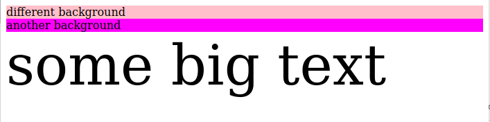

# 1.2 - CSS: The Basics - Workshop

## Exercise 2

- Open the provided index.html file in the browser.
- Modify the `style.css` file to match the following image

- Colors used are `pink` and `fuschia`
- text size is `5em` for the last line.

